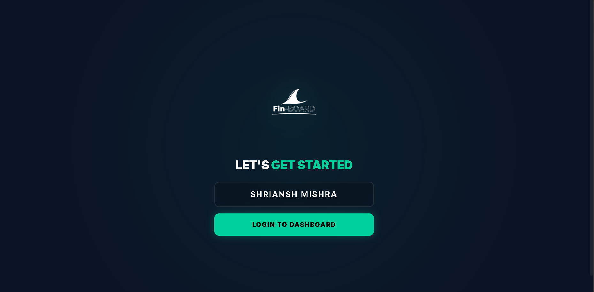

# 🦈 Fin-BOARD
**Next-Gen Financial Analytics Dashboard**

Fin-BOARD is a premium, real-time financial dashboard designed for high-impact data visualization and seamless API integration.

## 🌟 Features

### 💎 User Experience & Design
- **Premium Onboarding Flow**: Immersive, multi-stage entry sequence (Animated Logo ➔ Named Setup ➔ Dashboard Welcome).
- **Glassmorphism UI**: High-fidelity dark mode with dynamic shadows, glass blurs, and Framer Motion animations.
- **Persistent Personalization**: User name, dashboard layout, and API configurations are saved across sessions using local storage.
- **One-Click Cleanup**: Specialized "Clear All" utility with data backup/export options.

### 🛡️ Smart API Engine
- **Intelligent Autocomplete**: Real-time URL suggestions powered by global history and curated financial providers.
- **URL Memory**: Remembers and prioritizes previously used successful API endpoints.
- **Integrated CORS Proxy**: One-click toggle to bypass browser restrictions for third-party financial sources.
- **Automated Authentication**: Securely injects saved API keys and symbols into both proxied and direct requests.

### 📈 Advanced Visualization
- **Real Historical Benchmarks**: Native support for **CoinGecko OHLC** and Alpha Vantage datasets.
- **Adaptive Chart Intervals**: Auto-detects chart granularity (Daily/Weekly/Monthly) with glowing "Refresh Required" indicators.
- **Dynamic Field Mapping**: Interactive JSON explorer to map any nested API field to cards, tables, or charts.
- **Universal Currency Detection**: Automatic formatting for:
  - 💵 **USD ($)** | 💶 **EUR (€)** | 💷 **GBP (£)**
  - 🇮🇳 **INR (₹)** | ₿ **BTC** | Ξ **ETH**

### 🧩 Instant Templates
- **Top 25 Crypto Board**: Pre-configured table tracking the top assets by market capitalization.
- **Real-Time Candlesticks**: One-click setup for Bitcoin and Ethereum historical performance charts.
- **Live Exchange Rates**: Multi-currency conversion cards (BTC/INR/USD).

## 📸 Visual Showcase

| Entry | Welcome |
| :---: | :---: |
|  |  |

| Dashboard Overview | Toggle Theme |
| :---: | :---: |
|  |  |

| Browse Templates | API key Manager |
| :---: | :---: |
|  |  |

| Demo Dashboard | Clear Screen |
| :---: | :---: |
|  |  |

| My wallet (Static) | Analytics |
| :---: | :---: |
|  |  |

| Guide |  |
| :---: | :---: |
|  |  |

## 🚀 Getting Started
1. **Clone & Install**:
   ```bash
   git clone https://github.com/Samx9x/Fin-BOARD.git
   cd groww-web_intern
   npm install
   ```
2. **Run Dev Server**:
   ```bash
   npm run dev
   ```
3. **Explore**: Open [http://localhost:3000](http://localhost:3000)

## 🛠️ Tech Stack
- **Framework**: Next.js 14 (App Router), TypeScript
- **Styling**: Tailwind CSS, Custom CSS Variables
- **Animations**: Framer Motion
- **Charts**: Recharts
- **State**: Zustand (with Persist)
- **Grid**: React Grid Layout

## ❤️ Thank You!
Thank you for exploring Fin-BOARD! We hope this dashboard empowers your financial data journey.

---
Built with ❤️ by **SHRIANSH**
